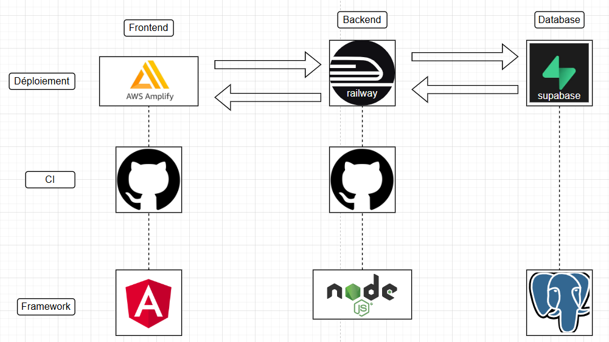
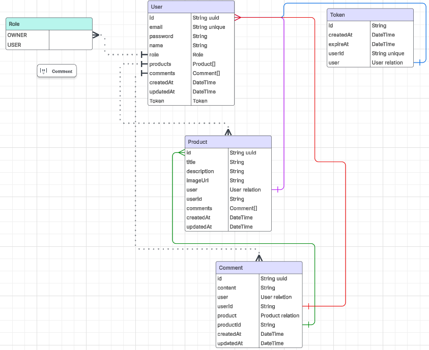
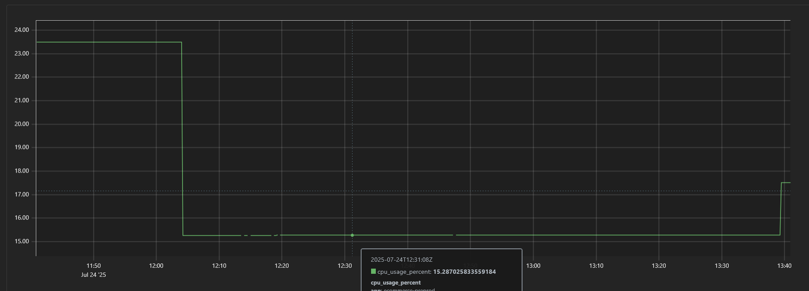
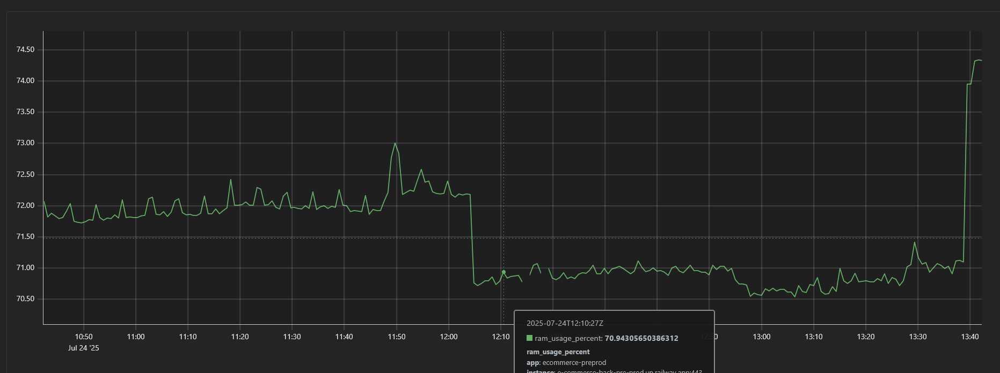

# 🛒 E-Commerce Backend API

A backend e-commerce API built with **Node.js**, **Express**, **TypeScript**, and **Prisma ORM**, supporting authentication, secure password handling, and a PostgreSQL database schema. Includes a full development workflow with TypeScript compilation, database migrations, and testing using Jest.

---

## 📦 Features

- ⚙️ Express server written in TypeScript
- 🧱 PostgreSQL database managed with Prisma ORM
- 🔐 JWT-based authentication with bcrypt password hashing
- 🧪 Unit & integration testing with Jest and Supertest
- 🗃 Database migrations and schema versioning
- 🌱 Environment configuration via `.env`
- 🔄 Makefile for common development commands

---

## 📁 Project Structure

```
.
├── index.ts             # Entry point
├── prisma/              # Prisma schema and migrations
├── dist/                # Compiled JS output (ignored in Git)
├── .env.example         # Sample environment variables
├── package.json         # NPM dependencies and scripts
├── tsconfig.json        # TypeScript configuration
├── Makefile             # Common dev commands
└── README.md            # Project documentation
```

---

## 🏗️ Global architecture

Architecture of the complete project 

</img>

---

## 🚀 Getting Started

### Prerequisites

- Node.js (v18+ recommended)
- PostgreSQL
- Yarn or npm

### 1. Clone the Repository

```bash
git clone git@github.com:JaxV9/e-commerce-back.git
cd e-commerce-back
```

### 2. Install Dependencies

```bash
npm install
```

### 3. Setup Environment Variables

Copy the `.env.example` and configure it:

```bash
cp .env.example .env
```

Fill in database credentials and JWT secrets.

### 4. Initialize the Database

```bash
make migrate
```

Or, to reset:

```bash
make reset-db
```

---

## 🧪 Running Tests

Tests are powered by **Jest** with full TypeScript support:

```bash
npm test
```

---

## 👨‍💻 Development

To start the server in development with TypeScript:

```bash
make start
```

To build for production:

```bash
npm run build
```

Then run with:

```bash
npm start
```

---

## 📊 Database Schema

This project uses Prisma with a normalized PostgreSQL schema.  
See `prisma/schema.prisma` for details.

</img>

---

## 📈 Performance serveur 

We use prometheus to monitor our serveur and the resources consumed. 

### CPU usage in % 
</img>


### RAM usage in %
</img>


---

## 🛠 Makefile Commands

| Command                 | Description                          |
|------------------------|--------------------------------------|
| `make start`           | Start the dev server (ts-node)       |
| `make migrate`         | Run a new Prisma migration           |
| `make reset-db`        | Reset and re-seed the database       |
| `make clear-migrations`| Remove all migration files           |
| `make wifi-ip`         | Show your current Wi-Fi IP address (macOS) |

---

## ✅ Technologies

- **Node.js**
- **TypeScript**
- **Express**
- **Prisma**
- **PostgreSQL**
- **Jest**
- **dotenv**
- **bcrypt / JWT**

---

## 📄 License

This project is licensed under the ISC License.

---

## 👤 Authors

- <a href="https://github.com/JaxV9">JaxV9</a>
- <a href="https://github.com/Nalithdev">Nalithdev</a>
- <a href="https://github.com/ImDimeh">ImDimeh</a>
- <a href="https://github.com/Pl83">Pl83</a>
